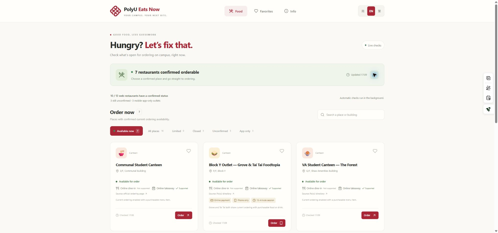

# PolyU Eats Now

**Good food, less guesswork.** A mobile-first campus tool showing where you can order food now, using evidence from official ordering systems.

[简体中文说明](README.zh-CN.md) · [Maintenance guide](docs/MAINTENANCE.md) · [Restore and migrate](docs/RESTORE_AND_MIGRATE.md)



Independent community project. **Not an official PolyU application.** Availability is not inferred from opening hours. An unconfirmed outlet is never counted as orderable.

## Features

- 16 campus outlets; separate filters for confirmed availability and app-only ordering.
- English (default), simplified Chinese and traditional Chinese; device-local favorites.
- Official order links, supported online order modes and last-check timestamps.
- Mobile-only ordering handoff, QR codes, online payment and session-limit labels where verified.
- FastAPI periodically checks official pages with read-only Playwright adapters. Users read cached results without triggering extra merchant requests.
- React, TypeScript, Vite, Tailwind CSS and PWA support. Frontend and API share one origin.

There is no account system, payment processing, automatic ordering or menu synchronization. Ordering and payment remain on the merchant's site.

## Run on Windows

Install Python 3.10+ and a Node.js version supported by Vite 7 (20.19+ or 22.12+), then run in the project directory:

```powershell
powershell.exe -NoProfile -ExecutionPolicy Bypass -File .\start.ps1 -Setup
```

Open http://127.0.0.1:8000. Setup installs dependencies and Chromium, builds the frontend, and starts the local server. It needs internet access. Press Ctrl+C to stop this foreground run.

After setup, **Start PolyU Eats Now.cmd** starts the app in the background and creates a phone preview. **Enable Auto Start.cmd** enables startup after signing in to Windows; **Disable Auto Start.cmd** removes it. See the migration guide before moving the folder.

## Run on Linux / macOS

```sh
python3 -m venv .venv
.venv/bin/python -m pip install -r backend/requirements.txt
.venv/bin/python -m playwright install --with-deps chromium
cd frontend
npm ci
npm run build
cd ..
.venv/bin/python -m uvicorn backend.main:app --host 127.0.0.1 --port 8000
```

Use a current supported Node.js release. OS dependencies may require administrative access on Linux.

## Hosting and phone access

Frontend-only hosting cannot run the availability checker. Use the included `Dockerfile`, `compose.yaml` and `Caddyfile` for a Linux server with your own HTTPS domain; see [deployment](DEPLOYMENT.md) and [migration](docs/RESTORE_AND_MIGRATE.md).

For a personal Windows computer, optional Tailscale Funnel provides a stable HTTPS device URL. Install and sign in to Tailscale yourself, then run **Configure Fixed Phone.cmd** and complete the first-use Funnel approval. Friends can use a browser without Tailscale. This publicly shares this app; a private site needs access controls. The PC must be signed in, online and awake.

Each user configures their own URL. Personal Tailscale configuration, logs, credentials and installed dependencies are not in this repository. Docker deployment files are prepared but have not been tested on a cloud server.

## API and evidence rules

- `GET /api/restaurants`: outlet metadata, status, reason and check timestamp; `Cache-Control: no-store`.
- `GET /api/health`: service identity, checker readiness and last completed cycle.
- `OPEN`: verified outlet, current ordering and a purchasable food or drink.
- `CLOSED`: official system explicitly stops current ordering.
- `LIMITED`: explicit restriction or only part of the outlet's ordering is confirmed.
- `UNKNOWN`: unavailable or insufficient evidence, access barriers or expired results.

Evidence expires after 180 seconds. A transient failure does not extend the previous timestamp; explicit closure or an access barrier replaces old evidence immediately. Online dine-in support is separate from physical seating and current availability. See [data sources](DATA_SOURCES.md) and [checker coverage](CHECKER_STATUS.md). Historical snapshots in documentation are not live status.

## Development and contributions

```sh
python -m pytest backend/tests tools/tests -q
cd frontend
npm ci
npm run build
```

Run tests with the project virtual environment. Contributions are welcome, particularly reliable adapters, source-backed names and mobile accessibility. Read [CONTRIBUTING.md](CONTRIBUTING.md) and [SECURITY.md](SECURITY.md).

Code and original documentation: [MIT](LICENSE). PolyU identity artwork and third-party content retain their owners' rights; they are excluded from the code license. See [THIRD_PARTY_NOTICES.md](THIRD_PARTY_NOTICES.md).
